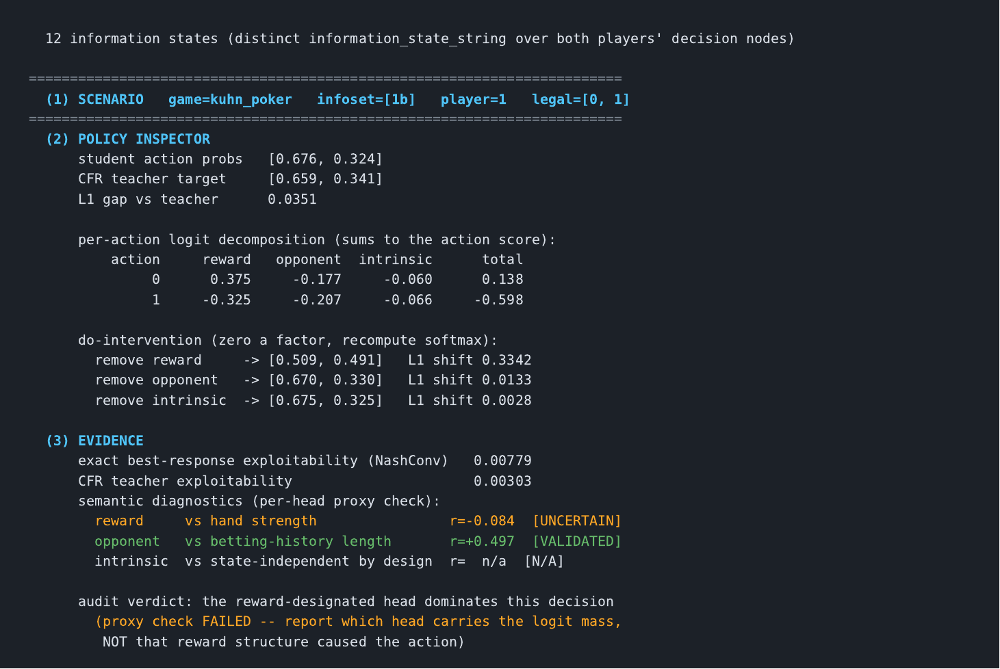
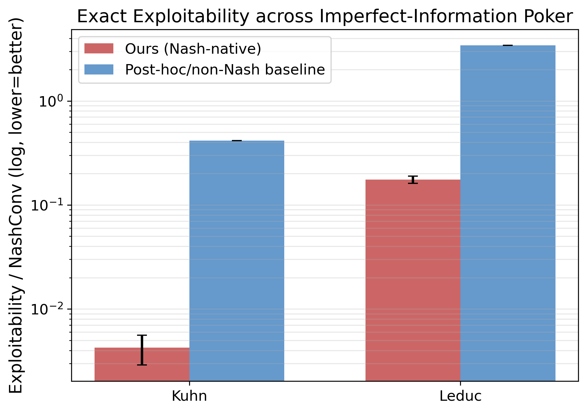
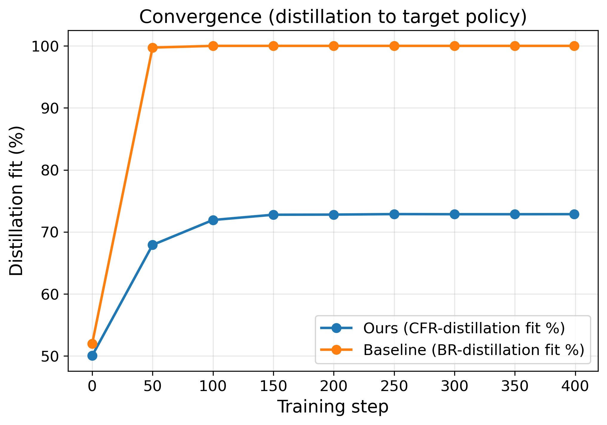
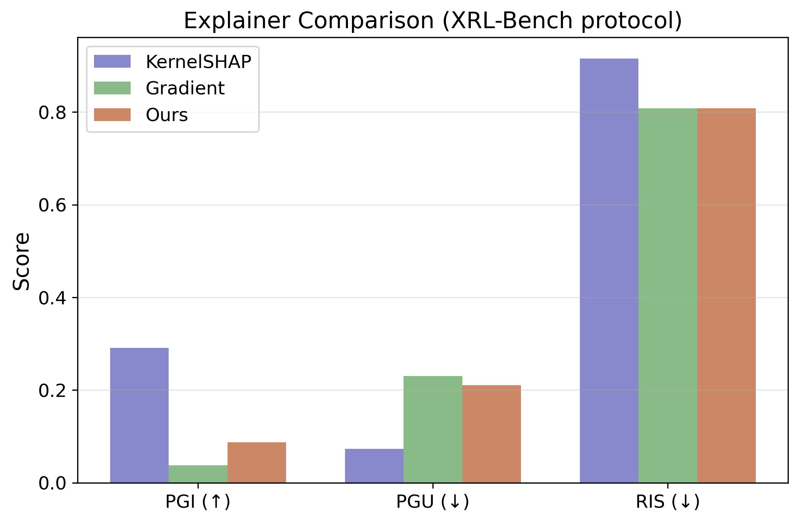
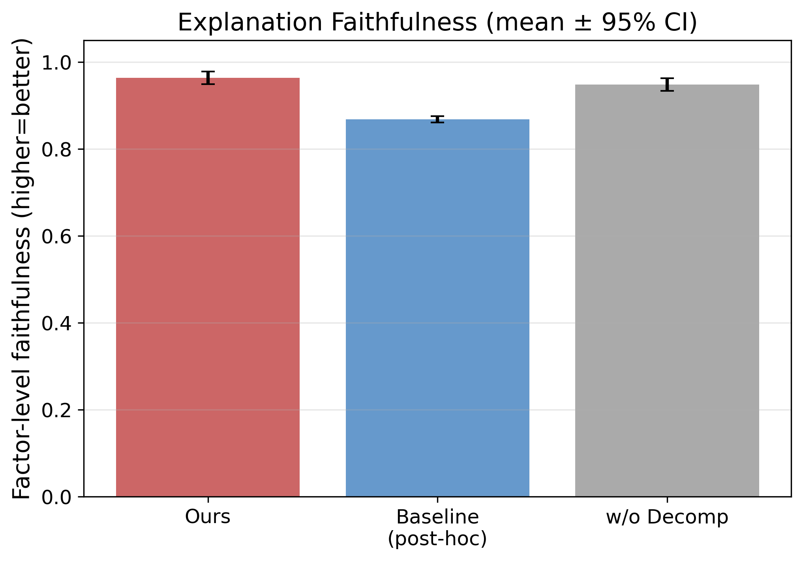
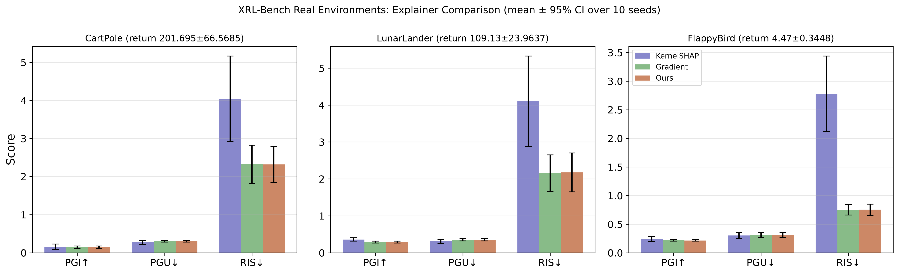
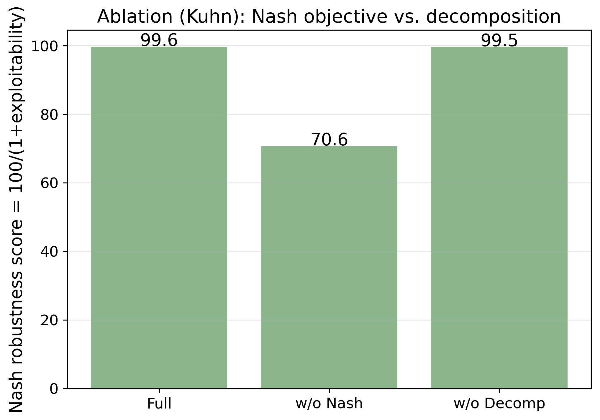

# NashLens

**Game-Native Interpretable RL via CFR-Distilled Nash Anchoring** — code, experiments, and results
for the BESC 2026 Industry Track paper.

NashLens distils a counterfactual-regret-minimization (CFR) teacher into an **additive student**
whose action logits decompose into *reward*, *opponent-history*, and *intrinsic* terms:

```
z(a | I) = z_reward(I) + z_opponent(I) + z_intrinsic
```

Because the logit **is** that sum, each factor's contribution and its removal effect are exact
properties of the policy computation rather than a post-hoc surrogate. In particular, attribution
consults no reference distribution, so it is invariant when the assumed opponent changes — which
SHAP and Integrated Gradients cannot be, since their counterfactuals need an opponent-induced
background or baseline.



*A real audit, verbatim: `python src/inspector.py --game kuhn_poker --infoset 1b`. Every panel above
is computed, not mocked — including the per-head proxy check that marks the reward head
**uncertain** and withholds the causal reading.*

**Scope, stated up front.** This is a workflow built from standard parts (CFR, policy distillation,
additive heads), not a new algorithm, and not a new solver. It targets small enumerable or
well-abstracted imperfect-information games. Play strength is inherited from — and bounded by — the
teacher. Factor *names* are intended-and-tested, never guaranteed; see
[Semantics](#semantics-what-the-factor-names-do-and-dont-mean). The inspector is a **command-line
tool** — there is no GUI and no hosted demo.

## What the paper shows

| Question | Answer, with the number |
|---|---|
| Does the audit head cost play strength? | No. Kuhn exploitability **0.0043±0.0014** vs. its CFR teacher's 0.003, and statistically indistinguishable from a single-head student on the same target. |
| Does it cost latency? | No. **1,798 parameters** on Kuhn, 4,361 on Leduc — *fewer* than the single-head student it replaces — at **0.027 ms** per decision on CPU. |
| Does it beat post-hoc explainers on the usual metrics? | **No, and we say so.** On XRL-Bench fidelity metrics the methods are comparable. |
| Then what is the advantage? | Attribution needs no reference distribution, so it is **invariant under opponent shift** (cosine **1.000**) where Integrated Gradients drifts to a worst case of **0.577** — nearly orthogonal attributions for the same decision. |
| Do the factor names mean what they say? | **Partly, and we tested rather than assumed.** The opponent head tracks betting history (*r*=0.44); the reward head does *not* track hand strength (*r*=**−0.67**). Names are intended-and-tested, never guaranteed. |
| Does it scale? | Unproven. On 24,576-state `liars_dice` the student beats a non-Nash baseline (0.391 vs. 0.629) but sits well above the CFR reference (0.022). |

Two findings here are negative and reported as such: the decomposition's faithfulness gain is not
statistically significant (*p*=0.17), and pushing the orthogonality penalty — the obvious knob for
"cleaner" factors — actively *hurts* semantic recovery (0.71 → 0.40). Both are in the paper.

## Install

Requires Python 3.11+ and a platform with an OpenSpiel wheel (Linux / macOS arm64).

```bash
python3 -m venv venv && source venv/bin/activate
pip install -r requirements.txt
```

`open_spiel` supplies the games (Kuhn, Leduc, `liars_dice`), the CFR solver, exact best-response
exploitability, and the NFSP / Deep CFR baselines.

## The inspector (per-decision audit)

The tool behind Figure 1 of the paper. It is a **command-line tool** — there is no GUI and no
hosted service.

```bash
# audit one information state
python src/inspector.py --game kuhn_poker --infoset 1b

# list every information state first
python src/inspector.py --game leduc_poker --list

# export the audit trail as JSON
python src/inspector.py --game kuhn_poker --infoset 1b --export audit.json
```

Output, on a real run of the contested Kuhn state `[1b]` (middle card, facing a bet):

```
  (1) SCENARIO   game=kuhn_poker   infoset=[1b]   player=1   legal=[0, 1]

  (2) POLICY INSPECTOR
      student action probs   [0.676, 0.324]
      CFR teacher target     [0.659, 0.341]
      L1 gap vs teacher      0.0351

      per-action logit decomposition (sums to the action score):
          action     reward   opponent  intrinsic      total
               0      0.375     -0.177     -0.060      0.138
               1     -0.325     -0.207     -0.066     -0.598

      do-intervention (zero a factor, recompute softmax):
        remove reward     -> [0.509, 0.491]   L1 shift 0.3342
        remove opponent   -> [0.670, 0.330]   L1 shift 0.0133
        remove intrinsic  -> [0.675, 0.325]   L1 shift 0.0028

  (3) EVIDENCE
      exact best-response exploitability (NashConv)   0.00779
      CFR teacher exploitability                      0.00303
      semantic diagnostics (per-head proxy check):
        reward     vs hand strength                r=-0.084  [UNCERTAIN]
        opponent   vs betting-history length       r=+0.497  [VALIDATED]
        intrinsic  vs state-independent by design  r=  n/a  [N/A]

      audit verdict: the reward-designated head dominates this decision
        (proxy check FAILED -- report which head carries the logit mass,
         NOT that reward structure caused the action)
```

Note the last block. Each head is labelled **validated** or **uncertain** from its proxy
correlation (threshold `PROXY_MIN_R = 0.30`), and when a head fails, the verdict names the head
carrying the logit mass instead of asserting causation. That distinction is the point: the removal
arithmetic is exact, the *label* may not be.

| Capability | Status | Flag |
|---|---|---|
| Game / information-state selection | ✅ | `--game`, `--infoset`, `--list` |
| Live policy inference | ✅ | — |
| Per-action logit decomposition | ✅ | — |
| Factor do-intervention (zero + recompute) | ✅ | — |
| Exact best-response exploitability | ✅ | — |
| CFR-teacher comparison | ✅ | — |
| Per-head validated / uncertain check | ✅ | — |
| JSON audit export | ✅ | `--export` |
| Graphical front-end / hosted demo | ❌ not implemented | — |

Runs are deterministic given `--seed`. Games supported: `kuhn_poker`, `leduc_poker`, `liars_dice`.

## Reproducing the paper

```bash
python src/run_main_experiments.py          # Tables 1, 4, 5, 6, 7, 8 + Figures 2, 3
python experiments/realenv_multiseed.py     # XRL-Bench control envs, 10 seeds
python experiments/plot_realenv_multiseed.py
python experiments/opponent_shift_stability.py   # Table 8
python experiments/emit_xrl_table.py             # Table 7 as LaTeX
python experiments/measure_inference_cost.py     # parameter counts + latency (Sect. 5.1)
```

### Deployment cost, as measured

`experiments/measure_inference_cost.py` produces the numbers quoted in the abstract and Sect. 5.1
(2,000 forward passes on CPU; output in `results/inference_cost.json`):

| Game | additive student | single-head student | per decision | + 3 do-interventions |
|---|---|---|---|---|
| Kuhn (in_dim 11, 2 actions) | **1,798 params** | 5,058 params | 0.026 ms | 0.047 ms |
| Leduc (in_dim 30, 3 actions) | **4,361 params** | 6,339 params | 0.027 ms | 0.046 ms |

The additive student is *smaller* than the single-head baseline it replaces: two single-hidden-layer
factor heads plus a bias vector cost less than one two-hidden-layer MLP.

Default configuration, matching the paper: CFR teacher 300 iterations on Kuhn/Leduc and 50 on
`liars_dice`; additive student with two 64-unit GELU heads plus a learned intrinsic bias, trained
400 steps with Adam at lr 5e-3; λ = 0.1; 10 random seeds with 95% CIs.

**Both heads receive the identical full information-state encoding**, and the **only** supervision
is cross-entropy to the CFR average policy — no auxiliary loss anchors a head to its name. The
masked variant (each head restricted to its own feature slice) is a diagnostic, not the default.

Exploitability is never back-propagated through: it is non-differentiable and is used for
*evaluation* only, computed exactly by OpenSpiel over the full tree.

### Reproducibility note

`torch.manual_seed` must be called **before** the networks are constructed — weight initialisation
determines how logit mass is distributed across factors, so seeding only inside the training loop is
not enough. `_train_eval`, `_lambda_sweep`, and `_teacher_quality` all do this, and repeated runs at
a fixed seed are bit-identical. (An earlier revision seeded too late; the published Table 4/5
numbers were unaffected — they were re-run and match to the last digit — and the 10-seed Kuhn mean
moved only from 0.0043±0.0014 to 0.0042±0.0012.)

## Results

**Equilibrium quality.** The additive student tracks its CFR teacher and stays far below a non-Nash
baseline. Distillation converges in a few hundred steps.

| | |
|---|---|
|  |  |
| Exact best-response exploitability (NashConv, log scale, lower is better) across Kuhn and Leduc. | Distillation fit toward the CFR target over training steps. |

**Attribution quality.** On the standard XRL-Bench fidelity metrics the three methods are broadly
comparable — we do not claim a metric win. The advantage is that the decomposition is inline and
directly inspectable, and invariant under opponent shift.

| | |
|---|---|
|  |  |
| KernelSHAP vs. gradient saliency vs. NashLens factor attribution on Kuhn. | Factor-level faithfulness. The additive head's edge over the single-head variant is **not** significant (*p*=0.17). |

**Real environments and ablations.**



*CartPole, LunarLander, FlappyBird — means with 95% CIs over 10 independently trained DQN seeds. The
wide intervals reflect genuine seed-to-seed variance in DQN training, not measurement noise.*



*Nash-robustness score `100/(1+exploitability)`. Removing the Nash objective collapses play quality
(99.6 → 70.6); removing the additive decomposition leaves it untouched (99.5).*

## Where each paper number comes from

| Paper | Content | Source |
|---|---|---|
| Table 1 | Exploitability, Kuhn / Leduc, 10 seeds | `results/experiment_results.json` → `kuhn_mean_ci`, `leduc_mean_ci` |
| Table 2 | Per-decision audit on real Kuhn states | `factor_intervention_cases_kuhn` |
| Table 3 | Aggregate factor statistics, all states | `factor_aggregate_stats_kuhn`, `..._leduc` |
| Table 4 | λ sweep | `lambda_sweep_kuhn` |
| Table 5 | CFR teacher quality | `teacher_quality_kuhn` |
| Table 6 | Semantic-validity battery | `factor_semantics_groundtruth` |
| Table 7 | XRL-Bench metrics, 3 control envs | `results/realenv_xrlbench_multiseed.json` |
| Table 8 | Stability under opponent shift | `results/opponent_shift_stability.json` |
| Fig. 2a/2b | Exploitability, distillation convergence | `figures/exploitability_compare.png`, `convergence.png` |
| Fig. 3 | Explainer comparison on Kuhn | `figures/explainer_compare.png` |
| Fig. 4 | XRL-Bench real-environment evaluation | `figures/realenv_all_compare.png` |
| Sect. 5.1 | Parameter counts, per-decision latency | `results/inference_cost.json` |

Two charts shown above under [Results](#results) were produced but cut from the camera-ready for
length; their numbers are in the paper's body text instead —
`figures/faithfulness_compare.png` (faithfulness 0.964±0.014 vs 0.948±0.015, *p*=0.17) and
`figures/ablation_result.png` (Nash robustness 99.6 / 70.6 / 99.5).

## Semantics: what the factor names do and don't mean

The honest result, and the one worth reading the paper for.

On a **controlled game with known ground-truth factors**, matched Pearson *r* against the true
factors (0.30 is the permutation-shuffle chance level):

| Configuration | matched *r* | inter-factor cosine |
|---|---|---|
| additive, no orthogonality (λ=0) | 0.71 | 0.72 |
| **additive, masked heads** | **0.78** | — |
| additive, orthogonality (λ=0.1) | 0.40 | 0.07 |
| permutation control (chance) | 0.30 | — |

**Orthogonality is a misleading proxy for identifiability.** Pushing inter-factor cosine down to
0.07 *reduces* true recovery from 0.71 to 0.40 — real reward and opponent influences need not be
orthogonal. So prefer input masking; failing that λ=0; reserve λ∈[0.05,0.1] for the narrow case
where an inspector needs visually separated bars and the names are not being relied upon. The λ=0.1
used for the paper's numbers predates this analysis and is *not* the recommended setting for a new
deployment.

On **real poker** the picture is mixed and we report it as such: the opponent head tracks
betting-history length (Kuhn *r*=0.44, Leduc *r*=0.46), but the reward head does **not** track hand
strength (*r*=−0.67). Three mechanisms compound: equilibrium Kuhn play bluffs, so the betting logit
is non-monotone in card rank; the additive identity gives completeness but not identifiability, and
the heads are collinear at λ=0 (cosine 0.97); and nothing in the loss anchors a head to a human
concept.

## Ablations

| Ablation | Play quality | Attribution |
|---|---|---|
| full recipe | exploitability 0.0043±0.0014 (robustness 99.6) | faithfulness 0.964±0.014 |
| − Nash objective | **0.4163** (robustness 70.6) — collapses | — |
| − additive decomposition | 0.0046±0.0025 (robustness 99.5) — unchanged | 0.948±0.015 |

The decomposition costs nothing in play strength. Its faithfulness gain is **not statistically
significant** (paired *t*=1.50, *p*=0.17, n=10), and we do not claim it. Its value rests on two
things a single-head policy cannot supply: invariance under opponent shift, and ground-truth
semantic recovery.

## Repository layout

```
src/
  inspector.py               per-decision audit CLI (Figure 1)
  poker_experiment.py        CFR teacher, additive student, all poker experiments & metrics
  run_main_experiments.py    driver reproducing the main tables
  chart_generator.py         figure rendering
  render_inspector_figure.py inspector output -> vector PDF
  agent_core/                config
experiments/
  realenv_multiseed.py       XRL-Bench control envs, multi-seed
  plot_realenv_multiseed.py  Figure 3c
  opponent_shift_stability.py Table 8
  emit_xrl_table.py          Table 7 -> LaTeX
results/                     JSON metric dumps behind every reported number
figures/                     result charts (PNG, embedded above) and the paper's
                             inspector panel as vector PDF
```

## Citation

```bibtex
@inproceedings{wang2026nashlens,
  title     = {NashLens: Game-Native Interpretable RL via CFR-Distilled Nash Anchoring},
  author    = {Wang, Chengjia and Wu, Runze and Zeng, Guangtao and Bu, Jiajun},
  booktitle = {Behavioural and Social Computing (BESC)},
  year      = {2026},
  note      = {Industry \& Demo Track}
}
```

## License

MIT — see [LICENSE](LICENSE).
